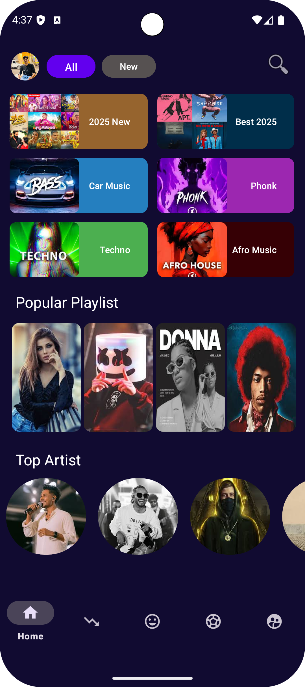
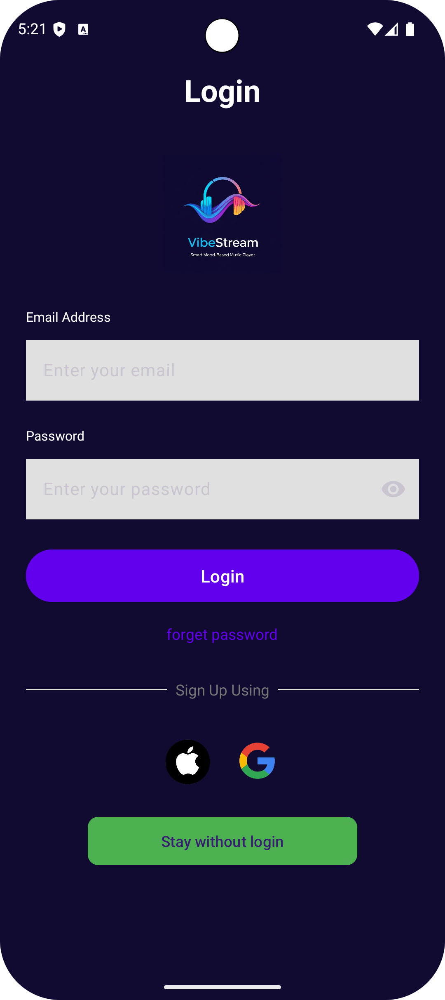
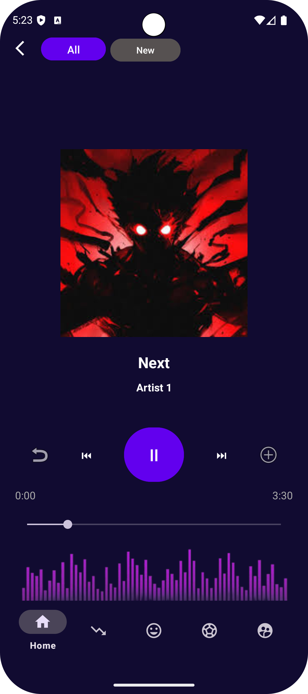
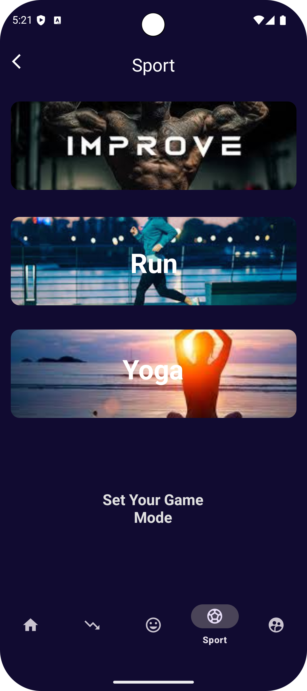
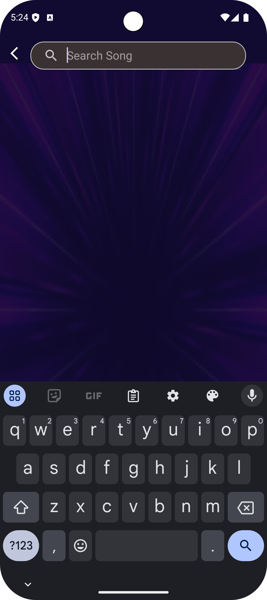
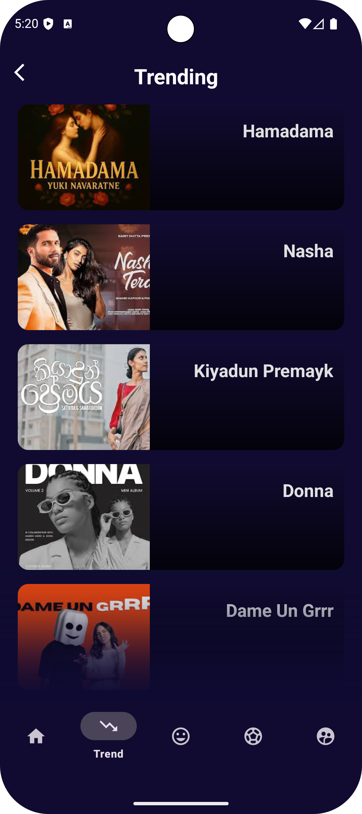
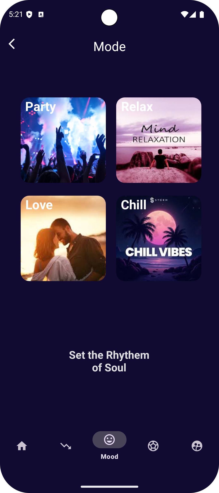
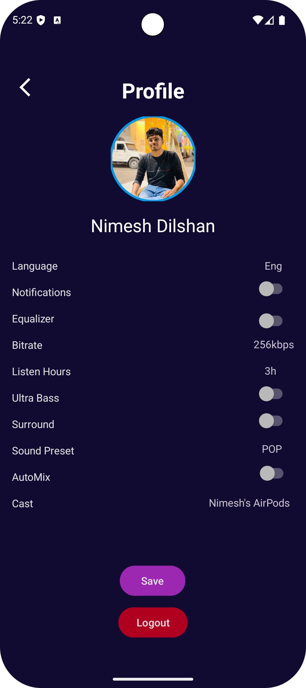

# 🎶 Vibe Stream – Music Streaming App  

**Category:** Entertainment  

---

## 📖 Overview  
Vibe Stream is **my very first Android Studio project** 🎉.  
It is a mobile application designed for music lovers to easily find and listen to their favorite songs **anytime, anywhere**.  

The app offers **personalized browsing, mood-based music selection, and sports playlists** to match the user’s activities.  

---

## 🚀 Key Features  
- 👤 **User Accounts** – Create and log in to your personal Vibe Stream account  
- 🎵 **Song Browsing** – Explore and listen to favorite tracks  
- ▶️ **Song Player** – Play tracks with an easy-to-use control interface  
- 🔥 **Trending Music** – Discover what’s currently popular  
- 😊 **Mood-Based Playlists** – Music categorized by moods (Happy, Sad, Chill, Love)  
- 🏋️ **Sports Modes** – Activity-specific music (Gym, Workout, Jogging, Running, Yoga)  
- ❤️ **Favorites List** – Save and access preferred songs quickly  
- 🔍 **Search** – Find any song easily  

---

## 🛠️ Tech Stack  
- **Language:** Java / Kotlin  
- **IDE:** Android Studio  
- **Backend (optional):** Firebase / Node.js  
- **Version Control:** Git & GitHub  

---

## 📸 Screenshots  

### 🎵 Home Screen


### 👤 Login Screen


### 🎧 Music Player


### 🏋️ Sports Mode


### 🔍 Search Screen


### 🎶 Trending Music


### 🎵 Mode Selection


### 👤 Profile Screen


 

---

## 🔧 Installation & Setup  
1. Clone the repository:  
   ```bash
   git clone https://github.com/nimeshdilshaan/Vibestream.git
